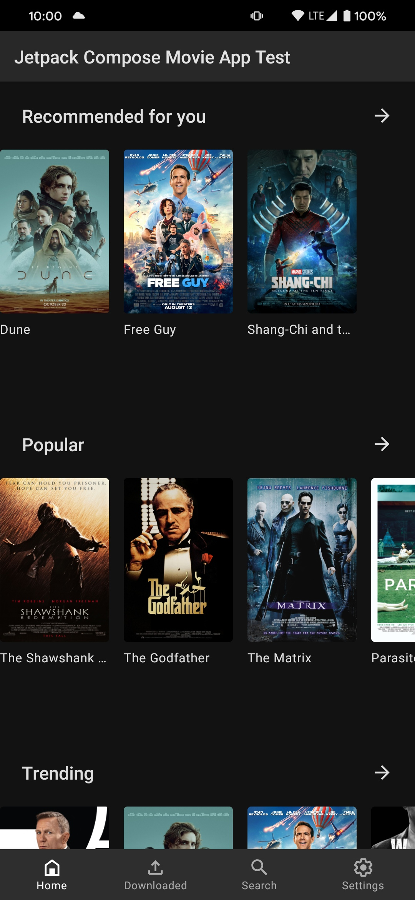
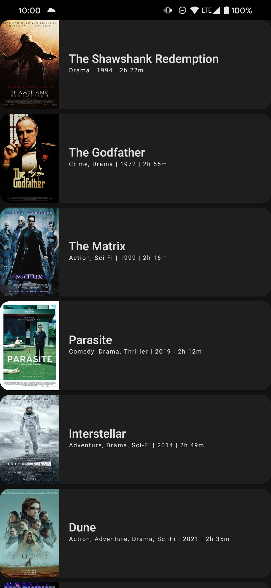
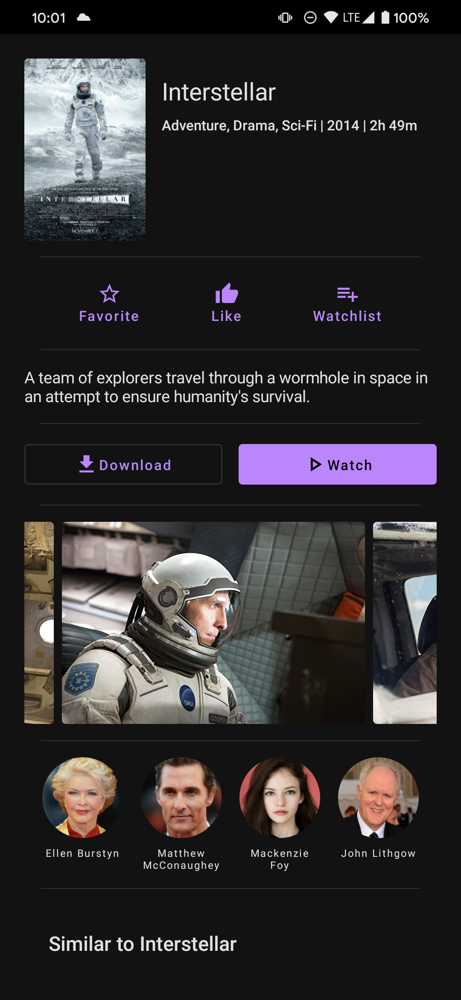
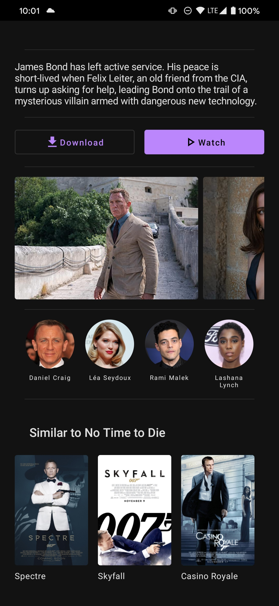
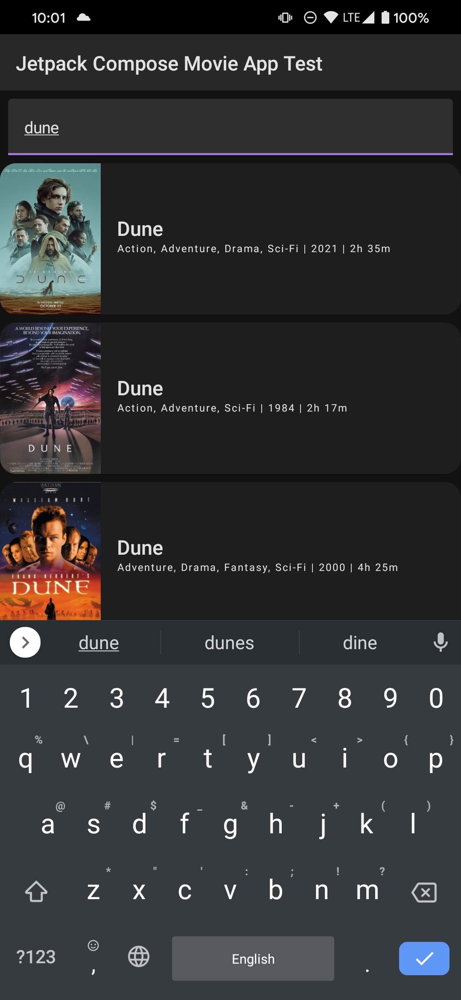

# movie-app
An example Android app using Jetpack Compose that displays movies and information from a custom backend.
## Demo
|  |  |  |  |  |
| --- | --- | --- | --- | --- |
## Libraries used
- Jetpack Compose
- Retrofit 2
- Dagger/Hilt
- Coil